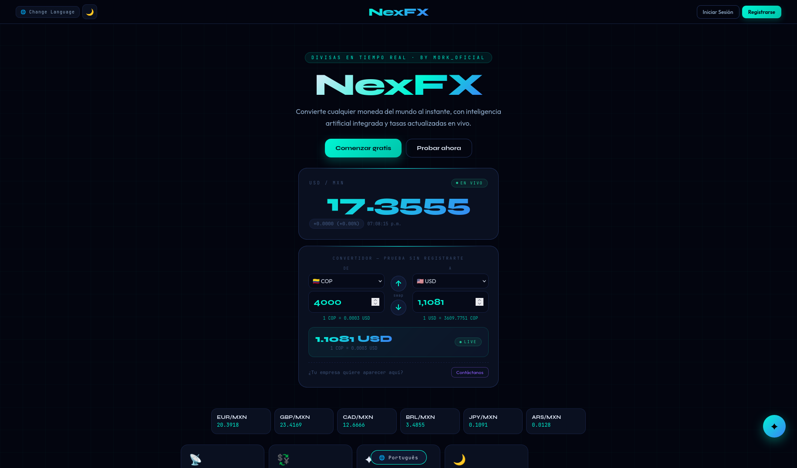

# NexFX — Proyecto MorkOficial

**Divisas en tiempo real · by Mork_Oficial**

NexFX es una plataforma de cambio y conversión de moneda con interfaz moderna (modo oscuro, acentos en gradiente cyan/azul). Convierte cualquier moneda al instante, con asistente de IA integrado (NORA) y tasas actualizadas en vivo.



Copia de respaldo y espacio colaborativo para que desarrolladores y programadores puedan revisar, sugerir mejoras y ayudar con el código del proyecto.

## Desarrollo

El repositorio incluye herramientas básicas de calidad de código:

```bash
pnpm install
pnpm run lint          # ESLint
pnpm run format:check  # Prettier (solo comprobar)
pnpm run format:write  # Prettier (aplicar formato)
```

## Créditos

| Rol             | Persona / usuario |
| --------------- | ----------------- |
| **Autor**       | MorkOficial       |
| **Colaborador** | fravelz           |

Licencia: MIT
